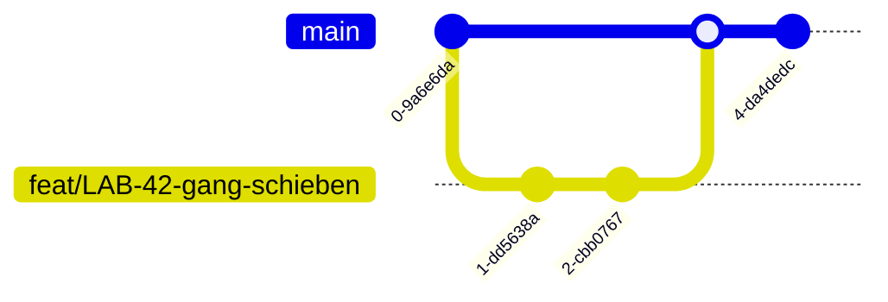
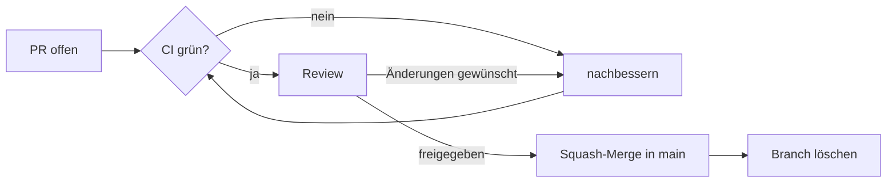

# Arbeiten in diesem Repository

Branches, Commits, Pull Requests, Reviews. Gilt für alle Module.

Wenn dir eine Regel unpraktisch erscheint, sprich sie an, statt sie zu umgehen.
Konventionen sind nur so viel wert, wie sich alle daran halten.

## Werkzeuge

Welche IDE oder welchen Editor du benutzt, ist deine Sache. Das Projekt baut
über die Kommandozeile, Formatierung regelt `.editorconfig`, und IDE-Ordner
stehen in `.gitignore`.

Was du brauchst: Git und eine lokale Java-Umgebung.

## Wo was liegt

| Wofür | Wo |
|---|---|
| User Stories, Aufgaben, Sprintplanung, Projektstand | **Jira** |
| Code, Reviews, Pull Requests, Build-Pipeline | **GitHub** |

Es gibt genau **einen** Tracker, und das ist Jira. GitHub Issues sind
abgeschaltet.

Verbunden werden beide Systeme über den **Jira-Key** (z. B. `LAB-42`). Er gehört
in jeden Branch-Namen und jede Commit-Nachricht. Dadurch erscheint die Arbeit
automatisch im zugehörigen Ticket, und man erkennt in der Git-Historie noch
Monate später, zu welcher Story ein Commit gehörte.

## Branch-Modell

`main` ist immer baubar. Jede Änderung kommt über einen kurzlebigen Branch und
einen Pull Request hinein.



## Der Ablauf

### 1. Aktuellen Stand holen

```bash
git switch main
git pull
```

Immer zuerst. Ein Branch, der von einem alten Stand abzweigt, produziert
vermeidbare Konflikte.

### 2. Branch anlegen

```bash
git switch -c feat/LAB-42-gang-schieben
```

Schema: `<typ>/<JIRA-KEY>-<kurzbeschreibung>`

| Typ | Wofür |
|---|---|
| `feat` | neue Funktionalität |
| `fix` | Fehlerbehebung |
| `docs` | nur Dokumentation |
| `test` | nur Tests |
| `refactor` | Umbau ohne Verhaltensänderung |
| `chore` | Build, Konfiguration, Werkzeuge |

Key groß, Kurzbeschreibung klein, Wörter mit Bindestrich, keine Umlaute.

Gibt es noch kein Ticket, leg vorher eins an. Für Kleinkram ohne eigenes Ticket
(Tippfehler, Aufräumen im Build) darf der Key entfallen:
`chore/gitignore-aufraeumen`. Das bleibt die Ausnahme.

### 3. Arbeiten und committen

**Vor jedem Commit muss der lokale Build grün sein.** Was lokal nicht baut, baut
auch in der Pipeline nicht und blockiert dann alle anderen.

Commit-Nachrichten folgen **Conventional Commits** mit dem Jira-Key als Scope:

```
<typ>(<JIRA-KEY>): <was geändert wurde, klein, kein Punkt am Ende>
```

```
feat(LAB-42): add push validation for fixed tiles
fix(LAB-57): prevent two figures on the same field after push
docs(LAB-13): describe bonus rules in pflichtenheft
chore: bump junit to 5.10.1
```

Sprache: **Englisch**. Alle Commits zu einer Story findest du später mit
`git log --grep=LAB-42`.

Lieber mehrere kleine Commits mit klarer Aussage als ein großer Sammel-Commit.
Ein Commit sollte eine Sache tun.

### 4. Hochladen und Pull Request

```bash
git push -u origin feat/LAB-42-gang-schieben
gh pr create
```

Das `-u` nur beim ersten Push eines Branches.

PR-Titel beginnt mit dem Jira-Key:

```
LAB-42: Gang-Schieben am Server validieren
```

Im PR-Text kurz beschreiben, **was** geändert wurde und **warum**. Das Ticket
selbst wird in Jira geschlossen, nicht über GitHub.

Mit dem PR startet die CI-Pipeline.

### 5. Review und Merge



- Mindestens **eine Freigabe** durch jemand anderen.
- Zuständigkeiten stehen in `.github/CODEOWNERS` und werden automatisch
  angefragt.
- Niemand mergt seinen eigenen PR ohne fremde Freigabe.
- **Squash-Merge**: alle Commits des Branches werden zu einem zusammengefasst.
  `main` bleibt dadurch linear und lesbar — ein Commit pro abgeschlossener
  Aufgabe.
- Branch nach dem Merge löschen (GitHub bietet das direkt an).

Ein Review ist kein Misstrauensvotum. Es ist die billigste Stelle, an der ein
Fehler noch auffallen kann.

## Was nicht erlaubt ist

- **Kein direkter Push auf `main`.** Der Branch ist geschützt; der Versuch
  schlägt fehl.
- **Kein `git push --force`** auf einen Branch, an dem jemand anderes arbeitet.
  Er überschreibt fremde Commits unwiederbringlich.
- **Keine Zugangsdaten im Repo.** Passwörter, Tokens und Schlüssel gehören in
  lokale Dateien, die in `.gitignore` stehen.
- **Keine Build-Ergebnisse oder IDE-Konfiguration committen.**
- **Keine Aufgabenverwaltung außerhalb von Jira.** Keine TODO-Listen in
  Markdown, keine Aufgaben in PR-Kommentaren, die nirgends landen.

## Lokale Git-Einstellungen

Identität — dieselbe E-Mail wie beim GitHub-Account, sonst werden deine Commits
nicht deinem Profil zugeordnet:

```bash
git config --global user.name "Dein Name"
git config --global user.email "deine@mail.at"
```

Zeilenenden — wir sind ein gemischtes Windows/macOS-Team:

```bash
# Windows
git config --global core.autocrlf true

# macOS / Linux
git config --global core.autocrlf input
```

Die `.gitattributes` im Repo erzwingt LF in der Historie; die lokale Einstellung
ist die zweite Sicherung. Ohne beides sehen Pull Requests so aus, als wären
hunderte Zeilen geändert, obwohl nur ein Wort getauscht wurde.

## Wenn etwas klemmt

**`not a git repository`** — du stehst außerhalb des Projektordners.

**Push abgelehnt: „protected branch"** — du versuchst, direkt auf `main` zu
pushen. Das ist Absicht. Leg einen Branch an.

**PR zeigt hunderte geänderte Zeilen, obwohl du kaum etwas geändert hast** —
Zeilenenden. `git config --global core.autocrlf` prüfen.
