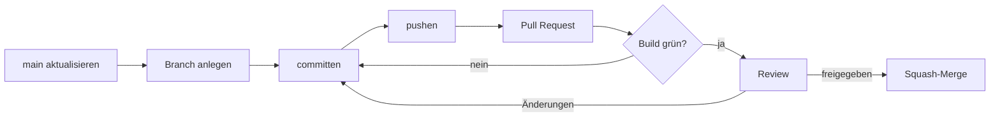
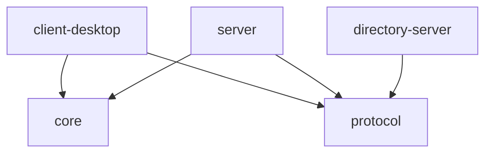

# Betriebshandbuch: Repository, Build und Auslieferung

Dieses Dokument beschreibt, **wie** Repository, Build und Auslieferung des
Projekts eingerichtet sind, einschließlich allem, was nur in
Weboberflächen geklickt wurde und deshalb im Code nicht sichtbar ist.

**Warum** etwas so entschieden wurde, steht in den
[Architekturentscheidungen (ADRs)](adr/README.md). Dieses Handbuch verweist
an den passenden Stellen darauf.

Verantwortlich: Technikverantwortung / DevOps (Manuel Junker).
Jede Änderung an Repository, Build oder Pipeline wird im selben Pull Request
hier nachgetragen, Abschnitt 8 hält sie chronologisch fest.

## Inhalt

1. [GitHub-Organisation und Rechte](#1-github-organisation-und-rechte)
2. [Repository-Einstellungen](#2-repository-einstellungen)
3. [Arbeitsablauf](#3-arbeitsablauf)
4. [Build](#4-build)
5. [Pipeline](#5-pipeline)
6. [Branch-Schutz](#6-branch-schutz)
7. [Releases und Tags](#7-releases-und-tags)
8. [Änderungsprotokoll](#8-änderungsprotokoll)

## 1. GitHub-Organisation und Rechte

| Was | Einstellung |
|---|---|
| Organisation | `mci-dibse-labyrinth-ws26` (kostenloser Plan) |
| Repository | `labyrinth`, **öffentlich** |
| Owner | Technikverantwortung |
| Team `entwickler` | alle Gruppenmitglieder, Recht **Write** auf `labyrinth` |
| Third-party access | eingeschränkt; freigegeben ist die JetBrains-App (IntelliJ) |

**Warum eine Organisation?** Das Repository gehört nicht einer Person. Rechte
werden einmal über das Team vergeben statt pro Person.

**Warum öffentlich?** Im kostenlosen Plan gibt es Branch-Schutz und
`CODEOWNERS` für Organisationen nur bei öffentlichen Repositories. Daraus folgt eine harte Regel: **Niemals Zugangsdaten
committen.**

**Third-party access:** Die Organisation blockiert fremde OAuth-Apps, bis ein
Owner sie freigibt. Ohne Freigabe scheitert der erste Push aus IntelliJ mit
`403`. Freigegeben unter *Organization Settings → Third-party access → OAuth
application policy*. Wer eine andere App nutzt, schickt beim ersten Zugriff
automatisch eine Anfrage, die dort bestätigt wird.

## 2. Repository-Einstellungen

Unter *Settings → General* des Repositories:

| Einstellung | Wert | Grund |
|---|---|---|
| Issues | **aus** | Einziger Tracker ist Jira; zwei Tracker laufen auseinander |
| Allow merge commits | aus | |
| Allow squash merging | **an** | Ein Commit pro abgeschlossener Aufgabe auf `main` |
| Default commit message (Squash) | „Pull request title and commit details“ | Der PR-Titel wird zur Commit-Nachricht auf `main` |
| Allow rebase merging | aus | |
| Automatically delete head branches | **an** | Keine Sammlung toter Branches |

Dazu kommen Dateien im Repository, die für alle gleich gelten:

| Datei | Zweck |
|---|---|
| `.gitignore` | Build-Ergebnisse, IDE-Ordner, lokale Konfiguration bleiben draußen |
| `.gitattributes` | Zeilenenden: LF im Repository, CRLF nur für Windows-Skripte (`*.bat`) |
| `.editorconfig` | UTF-8, LF, 4 Leerzeichen (Markdown/YAML/JSON: 2), unabhängig von der IDE |
| `.github/pull_request_template.md` | Vorlage für jeden Pull Request: Was, Warum, Jira, Checkliste |

## 3. Arbeitsablauf

Der vollständige Ablauf steht in [`CONTRIBUTING.md`](../CONTRIBUTING.md), die
Einrichtung eines Rechners in
[`entwicklungsumgebung.md`](entwicklungsumgebung.md). Kurzfassung:



- Branch-Namen: `<typ>/<JIRA-KEY>-<kurzbeschreibung>`
- Commit-Nachrichten und **PR-Titel**: `<typ>(<JIRA-KEY>): <beschreibung>`,
  englisch (Conventional Commits). Der PR-Titel wird beim Squash-Merge zum
  einzigen Commit auf `main`.
- Doku wird im selben Pull Request angepasst wie der Code.

Der Jira-Projekt-Key ist noch nicht festgelegt; bis dahin steht `LAB` als
Platzhalter.

## 4. Build

### 4.1 Überblick

| Was | Wert |
|---|---|
| Build-Werkzeug | Gradle **9.8.0**, über den Wrapper ([ADR 0003](adr/0003-gradle-als-build-werkzeug.md)) |
| Build-Skripte | Kotlin-DSL (`*.gradle.kts`) |
| Java | **21**, über die Gradle-Toolchain ([ADR 0004](adr/0004-jdk-21-temurin.md)) |
| Tests | JUnit **6** (Jupiter) |
| Oberfläche | JavaFX **21** |
| Struktur | ein Repository, fünf Module ([ADR 0002](adr/0002-ein-repository-mit-modulen.md)) |

Kernidee: **Niemand muss Gradle oder ein bestimmtes Java installieren**, und
alle bauen trotzdem mit denselben Versionen, lokal wie in der Pipeline.

### 4.2 Verzeichnisstruktur

```
labyrinth/
├── settings.gradle.kts             Projektname, Module, Repositories, JDK-Download
├── gradlew, gradlew.bat            Wrapper-Startskripte (macOS/Linux, Windows)
├── gradle/
│   ├── libs.versions.toml          Versionskatalog: alle Versionen an einer Stelle
│   └── wrapper/                    Wrapper-Programm und Gradle-Version
├── buildSrc/                       gemeinsame Build-Logik
│   ├── build.gradle.kts
│   ├── settings.gradle.kts         macht den Versionskatalog in buildSrc verfügbar
│   └── src/main/kotlin/
│       └── labyrinth.java-conventions.gradle.kts
├── protocol/   core/   server/   directory-server/   client-desktop/
│   ├── build.gradle.kts            je Modul: was es ist und was es benutzt
│   └── src/main/java, src/test/java
└── docs/
```

### 4.3 Gradle Wrapper

Der Wrapper besteht aus `gradlew`, `gradlew.bat` und `gradle/wrapper/`. In
`gradle/wrapper/gradle-wrapper.properties` steht die Gradle-Version. Beim
ersten Aufruf lädt der Wrapper genau diese Version herunter und legt sie im
Benutzerordner ab (`~/.gradle/wrapper/dists`).

Besonderheiten:

- `gradle-wrapper.jar` ist die einzige `.jar`-Datei im Repository. Die
  `.gitignore` nimmt sie mit `!gradle/wrapper/gradle-wrapper.jar` ausdrücklich
  aus.
- `gradlew` ist in Git als **ausführbar** gespeichert (Dateimodus `100755`),
  sonst könnten macOS- und Linux-Nutzer es nicht starten. Windows kennt dieses
  Merkmal nicht; gesetzt wurde es mit `git add --chmod=+x gradlew`.
- `.gitattributes` sorgt dafür, dass `gradlew` LF- und `gradlew.bat`
  CRLF-Zeilenenden behält.

Der Wrapper wurde einmalig mit einer heruntergeladenen Gradle-Distribution
erzeugt (`gradle wrapper`). Seitdem ist keine Gradle-Installation mehr nötig.

### 4.4 Module und Abhängigkeiten



| Modul | Art | Inhalt |
|---|---|---|
| `protocol` | Bibliothek | Nachrichtenklassen und JSON-Serialisierung |
| `core` | Bibliothek | Spielmodell und Spielregeln |
| `server` | Anwendung | Spielserver |
| `directory-server` | Anwendung | Verzeichnisserver |
| `client-desktop` | Anwendung | JavaFX-Client mit KI |

Regeln:

- Module werden in `settings.gradle.kts` (Hauptordner) mit `include(...)`
  aufgenommen.
- Eine Abhängigkeit zwischen Modulen ist eine Zeile in der `build.gradle.kts`
  des benutzenden Moduls: `implementation(project(":core"))`. Was dort nicht
  steht, kann ein Modul nicht benutzen; der Compiler meldet einen Fehler.
- `core` und `protocol` hängen bewusst **nicht** voneinander ab. Das Protokoll
  wird gruppenübergreifend abgestimmt (Lastenheft, Abschnitt 5) und soll nicht
  an internen Klassen hängen. Server und Client übersetzen zwischen beiden.
- `client-desktop` kennt `server` nicht und umgekehrt.
- Anwendungen haben das Gradle-Plugin `application` und damit die Aufgabe
  `run`. Die Startklasse steht in `application { mainClass = ... }`.
- Paketnamen: `edu.mci.labyrinth.<modul>` (abgeleitet von der Domain
  `mci.edu`).

### 4.5 Gemeinsame Konfiguration (Konventions-Plugin)

Was für alle Java-Module gleich ist, steht einmal in
`buildSrc/src/main/kotlin/labyrinth.java-conventions.gradle.kts`:

```kotlin
plugins {
    java
}

val libs = extensions.getByType<VersionCatalogsExtension>().named("libs")

java {
    toolchain {
        languageVersion = JavaLanguageVersion.of(21)
    }
}

testing {
    suites.named<JvmTestSuite>("test") {
        useJUnitJupiter(libs.findVersion("junit").get().requiredVersion)
    }
}
```

Jedes Modul übernimmt das mit einer Zeile:

```kotlin
plugins {
    id("labyrinth.java-conventions")
}
```

`buildSrc` ist ein Sonderordner: Gradle baut ihn vor allem anderen und stellt
die Plugins darin allen Build-Skripten zur Verfügung. Der Dateiname ohne
`.gradle.kts` ist die Plugin-ID.

Hinweis zur Zeile `val libs = ...`: In normalen Build-Skripten heißt der
Versionskatalog einfach `libs`. In Plugins unter `buildSrc` muss man ihn so
anfordern. Damit `buildSrc` den Katalog überhaupt kennt, verweist
`buildSrc/settings.gradle.kts` auf `../gradle/libs.versions.toml`.

### 4.6 Versionskatalog

`gradle/libs.versions.toml` ist die **einzige** Stelle, an der Versionen von
Bibliotheken und Plugins stehen:

| Eintrag | Version | Wofür |
|---|---|---|
| `junit` | 6.1.3 | Tests |
| `javafx` | 21.0.12 | Oberfläche des Desktop-Clients |
| Plugin `org.openjfx.javafxplugin` | 0.1.0 | bindet JavaFX passend zum Betriebssystem ein |

Zusätzlich, außerhalb des Katalogs:

| Was | Version | Wo |
|---|---|---|
| Gradle | 9.8.0 | `gradle/wrapper/gradle-wrapper.properties` |
| Plugin `foojay-resolver-convention` | 1.0.0 | `settings.gradle.kts` (Settings-Plugins können den Katalog nicht nutzen) |

### 4.7 Java-Version und Toolchain

Zwei verschiedene Java-Rollen:

1. **Gradle selbst** läuft auf irgendeinem JDK ab Version 17. In IntelliJ ist
   das die „Gradle JVM“ (Settings → Build Tools → Gradle), im Terminal das JDK
   aus `JAVA_HOME`.
2. **Kompiliert, getestet und gestartet** wird immer mit Java 21. Das legt die
   **Toolchain** im Konventions-Plugin fest, unabhängig davon, womit Gradle
   selbst läuft.

Woher kommt das JDK 21 für die Toolchain? Gradle sucht in dieser Reihenfolge:

1. bereits installierte JDKs (übliche Installationsorte, `JAVA_HOME`, von
   IntelliJ heruntergeladene JDKs in `~/.jdks`)
2. falls keines passt: automatischer Download über den Dienst **foojay**
   (Plugin `foojay-resolver-convention` in `settings.gradle.kts`) nach
   `~/.gradle/jdks`

Beobachtung beim Test auf einem frischen Laptop (08.10.2026): IntelliJ fragt
beim ersten Laden nach einem JDK, um Gradle zu starten. Mit **21 / Eclipse
Temurin** findet Gradle dasselbe JDK auch für die Toolchain; ein zweiter
Download entfällt. Deshalb empfiehlt die Einrichtungsanleitung genau diese
Auswahl.

### 4.8 Tests

- JUnit 6 (Jupiter-API: `@Test`, `assertEquals` …), eingebunden über
  `useJUnitJupiter(...)` im Konventions-Plugin. Gradle fügt die nötigen
  Bibliotheken selbst hinzu.
- Tests liegen in `src/test/java`, im selben Paket wie die getestete Klasse.
- `build` führt alle Tests aus; Testberichte liegen danach unter
  `<modul>/build/reports/tests/test/index.html`.

### 4.9 JavaFX

JavaFX ist seit Java 11 nicht mehr im JDK enthalten. Das Plugin
`org.openjfx.javafxplugin` lädt die passende Variante für das jeweilige
Betriebssystem (Windows, macOS Intel/Apple Silicon, Linux) und sorgt dafür,
dass `run` den Client korrekt startet. Konfiguration in
`client-desktop/build.gradle.kts`:

```kotlin
javafx {
    version = libs.versions.javafx.get()
    modules("javafx.controls")
}
```

Weitere JavaFX-Module (z. B. `javafx.fxml`) werden dort ergänzt.

Version 21: JavaFX 25 und neuer benötigen ein neueres JDK als 21.

### 4.10 Wichtige Befehle

| Befehl (Windows; macOS/Linux: `./gradlew`) | Wirkung |
|---|---|
| `.\gradlew.bat build` | alles kompilieren, testen, paketieren |
| `.\gradlew.bat test` | nur Tests |
| `.\gradlew.bat :server:run` | Spielserver starten |
| `.\gradlew.bat :directory-server:run` | Verzeichnisserver starten |
| `.\gradlew.bat :client-desktop:run` | Desktop-Client starten |
| `.\gradlew.bat clean` | Build-Ergebnisse löschen |
| `.\gradlew.bat build --warning-mode all` | Build mit allen Hinweisen auf veraltete Funktionen |

**Neue Bibliothek einbinden** (Beispiel, Namen und Version anpassen):

```toml
# gradle/libs.versions.toml
[versions]
gson = "x.y.z"

[libraries]
gson = { module = "com.google.code.gson:gson", version.ref = "gson" }
```

```kotlin
// <modul>/build.gradle.kts
dependencies {
    implementation(libs.gson)
}
```

**Neues Modul anlegen:** Ordner mit `build.gradle.kts` anlegen
(`plugins { id("labyrinth.java-conventions") }`), in `settings.gradle.kts`
unter `include(...)` ergänzen, Gradle in IntelliJ neu laden.

**Gradle aktualisieren:**

```powershell
.\gradlew.bat wrapper --gradle-version <neue-version>
```

Danach einmal bauen und alle geänderten Dateien unter `gradle/wrapper/` sowie
`gradlew`, `gradlew.bat` committen.

### 4.11 Bekannte Probleme

| Problem | Auswirkung | Umgang |
|---|---|---|
| Das JavaFX-Plugin 0.1.0 (letzte Version, September 2023) nutzt beim Start des Clients eine veraltete Gradle-Funktion („Invocation of Task.extensions at execution time“). Gradle meldet: „Deprecated Gradle features were used …, making it incompatible with Gradle 10.“ | Nur `:client-desktop:run`. Build und Tests sind nicht betroffen. Funktioniert bis einschließlich Gradle 9. | Beobachten. Vor einem Wechsel auf Gradle 10 prüfen, ob es eine neue Plugin-Version gibt; sonst JavaFX ohne Plugin einbinden. |
| Gradle empfiehlt bei jedem Build den „Configuration Cache“. | keine | Später prüfen und ggf. aktivieren. |

## 5. Pipeline

*Geplant.* GitHub Actions baut und testet jeden Push und jeden Pull Request auf
einem Linux-Rechner (`.github/workflows/build.yml`). Damit läuft der Build
regelmäßig auf drei Betriebssystemen: Windows und macOS im Team, Linux in der
Pipeline.

## 6. Branch-Schutz

*Geplant*, nachdem alle das Projekt einmal gebaut und einen ersten Pull Request
durchgespielt haben. Vorgesehen für `main`: Änderungen nur per Pull Request,
mindestens eine Freigabe, Pipeline muss grün sein. Zuständigkeiten pro Ordner
über `.github/CODEOWNERS` (`protocol/` → Schnittstellenvertretung, `docs/` →
Qualitätsmanagement).

Bewusst zuletzt: Solange nur eine Person am Repository arbeitet, würde die
Review-Pflicht sie selbst blockieren.

## 7. Releases und Tags

*Geplant.* Zu jeder Abgabe wird der abgegebene Stand auf `main` mit einem
Git-Tag markiert, damit jederzeit nachvollziehbar ist, was abgegeben wurde.

| Datum | Abgabe |
|---|---|
| 25.10.2026 | Pflichtenheft |
| 22.11.2026 | Testplan und Unit Tests |
| 16.12.2026 | Zwischenpräsentation |
| 24.01.2027 | Finale Abgabe |

## 8. Änderungsprotokoll

| Datum | Änderung | Wo |
|---|---|---|
| 24.09.2026 | Organisation, Team `entwickler`, Repository angelegt; `.gitignore`, `.gitattributes`, `.editorconfig`, `README.md`, `CONTRIBUTING.md` | Commits vor PR #1 |
| 24.09.2026 | Repository-Einstellungen (Abschnitt 2) gesetzt; JetBrains-App freigegeben | GitHub-Oberfläche |
| 24.09.2026 | PR-Vorlage; PR-Titel im Commit-Format | PR #1 |
| 30.09.2026 | Gruppenbeschluss: ein Repository mit Modulen, Gradle, JDK 21 | Besprechung, ADR 0002–0004 |
| 08.10.2026 | Gradle-Grundgerüst: Wrapper 9.8.0, fünf Module, Konventions-Plugin, Versionskatalog, Toolchain Java 21, JUnit 6, JavaFX 21; Einrichtungsanleitung, dieses Handbuch, ADRs 0001–0004 | Branch `chore/gradle-grundgeruest` |
